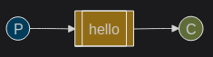
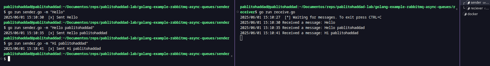

# RabbitMQ with Golang! 

[](https://golang.org)
[](https://www.rabbitmq.com/)

A simple project demonstrating RabbitMQ messaging with Go, featuring a sender (producer) and receiver (consumer). Im using the [RabbitMQ Docs](https://www.rabbitmq.com/tutorials/tutorial-one-go)

## 🧠 Core Concepts

The RabbitMQ is a message broker, and has three principals components. 

 1. Producer: Sends messages to a queue

 2. Queue: Message buffer (handled by RabbitMQ)

 3. Consumer: Receives and processes messages

The Diagram explains this simple idea for RabbitMQ:



## 📦 How to code?

```bash
# Clone the repo
git clone https://github.com/pablitohaddad/pablitohaddad-lab.git

# Enter into path program
cd pablitohaddad-lab/golang-example-rabbitmq-async-queues

# Run RabbitMQ Image
docker run -it --rm --name rabbitmq -p 5672:5672 -p 15672:15672 rabbitmq:4-management

# Run project in two differents terminals
go run sender/sender.go -m "Hello"
go run receiver/receiver.go

# You can change the message! Example:
go run sender/sender.go -m "Hello pablitohaddad"
go run sender/sender.go -m "Hi pablitohaddad"

```

Result after some tests:

